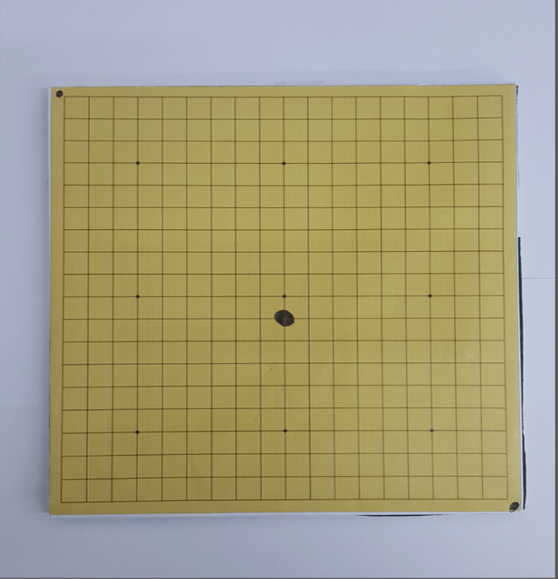
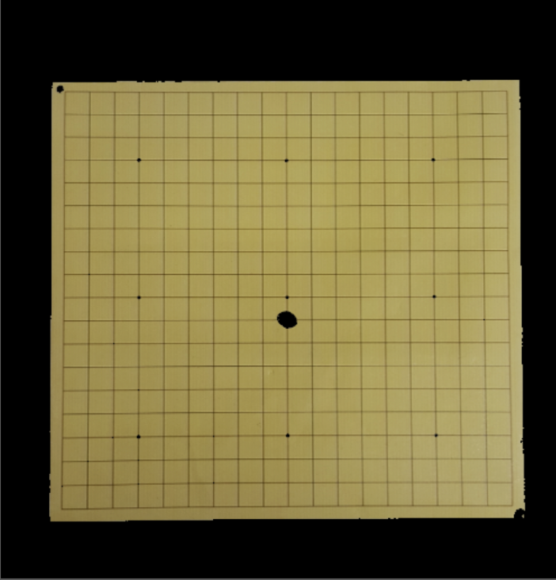
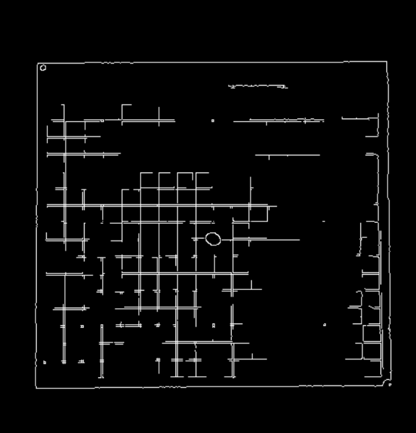
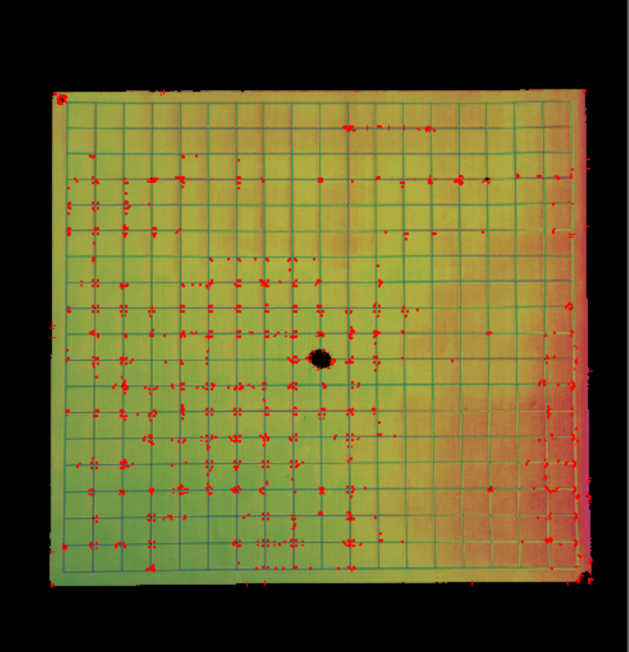
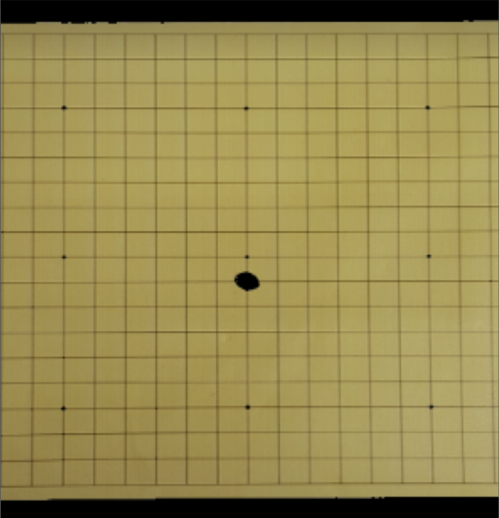

# GoUarm
This is a vision code for DeepTree preoject

## Requirement
* [Python 3.6+]
* [OpenCV-python]
* [Numpy]

## Step
- #### step1

- #### step2: Yellow Detection

- #### step3: Edge Detection

- #### step4: Corner Detection

- #### step5: Geometric

